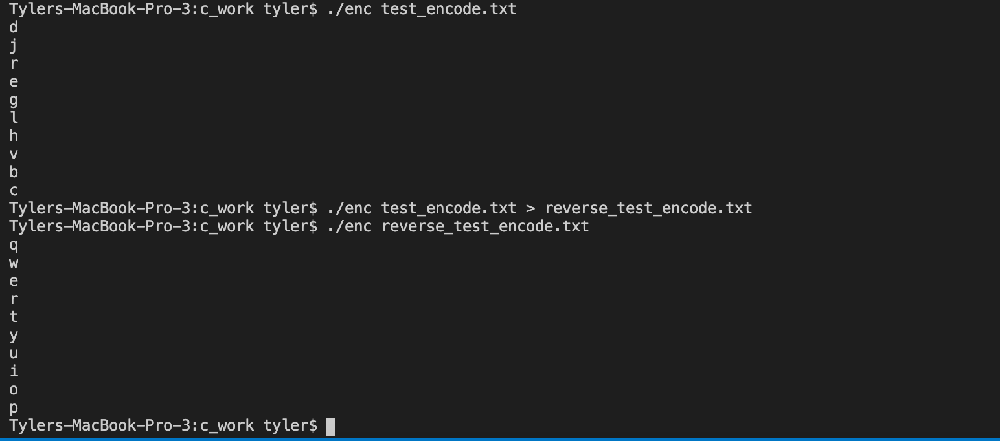
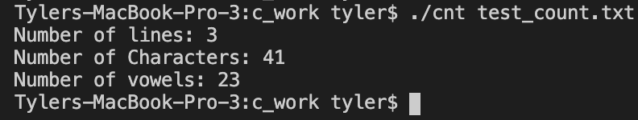
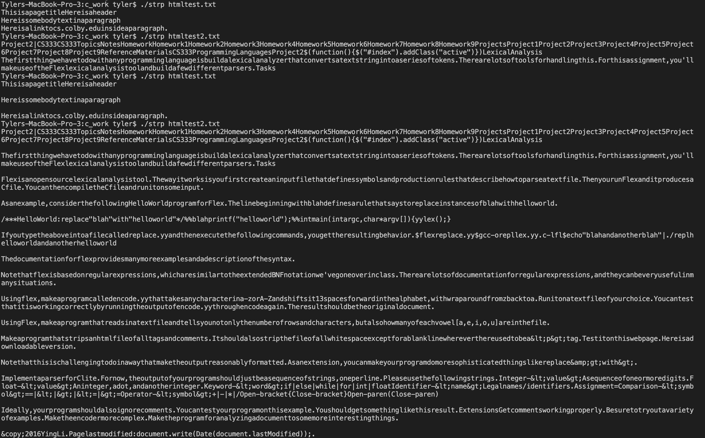
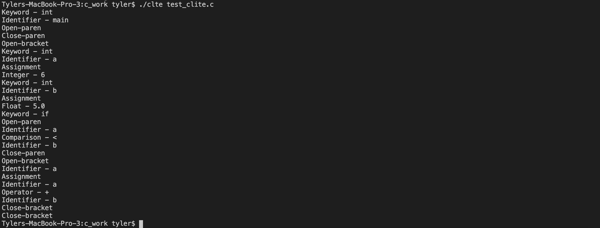

## CS333 Project 2 - Individual Work in C

### Tyler Hansen

#### Directory Guide

```
/c_work
├── README.md <-- You are here! You are here! (If you have the README open, of course. In GitHub, you will see this if you are just in the /c_work directory.)
├── clite.yy: Implements the CLITE Syntax.
├── clite_output.png: Displays the output of running ".\clte test_clite.c"
├── clte: The executable created by running "gcc -o clte clite.yy"; used to run our Clite parser.
          Command line argument is the C file to analyze.
├── cnt: The executable created by running "gcc -o cnt count.yy"; used to run the number of characters, lines, and vowels parser.
         Command line argument is the text file to analyze.
├── count.yy: Counts the number of characters, lines, and vowels in a given text file.
├── count_output.png: Displays the output of running ".\cnt test_count.txt"
├── enc: The executable created by runnning "gcc -o enc encode.yy"; used to run the encoder we rote.
         Command line argument is the text file to analyze.
├── encode.yy: Takes any character in a-z and shifts it 13 spaces forward in the alphabet, with wraparound from z back to a.
├── encode_output.png: Displays the output of running ".\enc test_encode.txt", saving the output to a text file, and demonstrating wraparound.
├── html_output.png: Displays the output of running ".\strp htmltest.txt" and "\.strp htmltest2.txt"
├── htmltest.txt: A test file for the HTML stripper.
├── htmltest2.txt: A more complex test file for hte HTML stripper.
├── lex.yy.c: A whole bunch of random stuff that works for flex.
├── reverse_test_encode.txt: The output of the original encoder test; used to demonstrate wraparound.
├── strip_html.yy: Strips an HTML file of all tags and comments.
├── strp: The executable created by running "gcc -o strp strip_html.cc"; used to run the HTML stripper.
          Command line argument is the text file containing HTML code to strip.
├── test_clite.c: Ying's provided example of a C file for testing the Clite parser we wrote.
├── test_count.txt: My favorite Haiku used to test the character, line, and vowel counter.
└── test_encode.txt: A simple string to test the a-z encoder we wrote.
```

#### Foreword

All C code was written and compiled on Mac OS X Big Sur with the following `gcc` version information:

```
Configured with: --prefix=/Applications/Xcode.app/Contents/Developer/usr --with-gxx-include-dir=/Applications/Xcode.app/Contents/Developer/Platforms/MacOSX.platform/Developer/SDKs/MacOSX.sdk/usr/include/c++/4.2.1
Apple clang version 12.0.0 (clang-1200.0.32.29)
Target: x86_64-apple-darwin20.2.0
Thread model: posix
InstalledDir: /Applications/Xcode.app/Contents/Developer/Toolchains/XcodeDefault.xctoolchain/usr/bin
```

#### Task 1: Encode

I wrote the file `encode.yy` and tested it in what I think is a clever way; if it is working properly, encoding a sequence of characters, then encoding the result should return the original characters. So that's exactly what I did:


#### Task 2: Count

I wrote the file `count.yy` and tested it on `test_count.txt`, which contains my favorite Haiku. It correctly returns all of the information:


#### Task 3: Stripping HTML

I wrote the file `strip_html.yy` and tested it on both of Ying's examples. It correctly strips the HTML according to specification, and here is the result of running it on both of Ying's test files:



#### Task 4: Clite Implementation

I wrote the file `clite.yy` and tested it on Ying's example. It correctly implements Clite according to specification, and here is the result of running it on Ying's test file:


