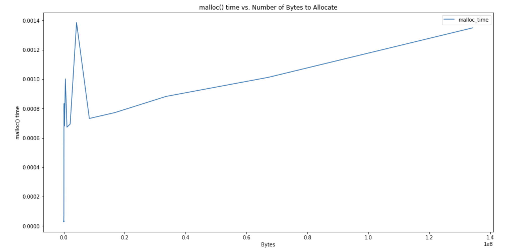
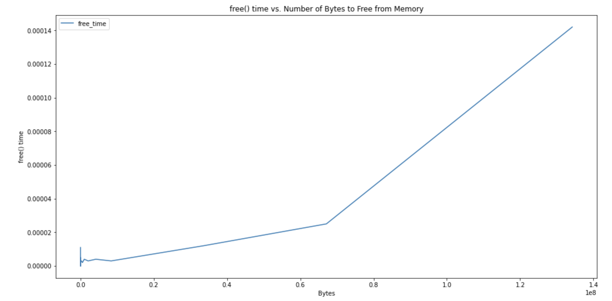
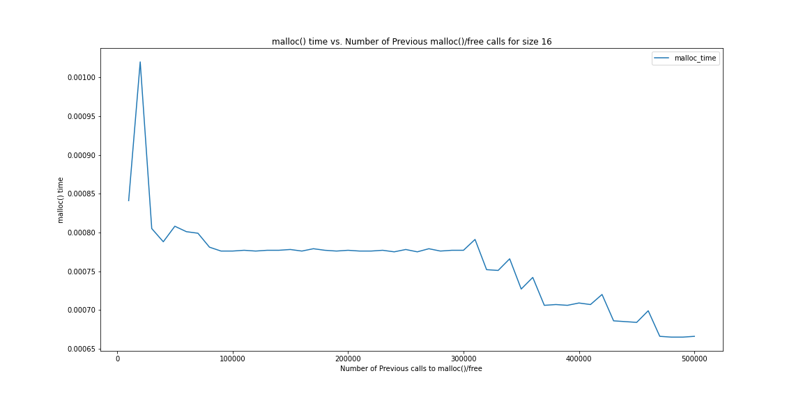
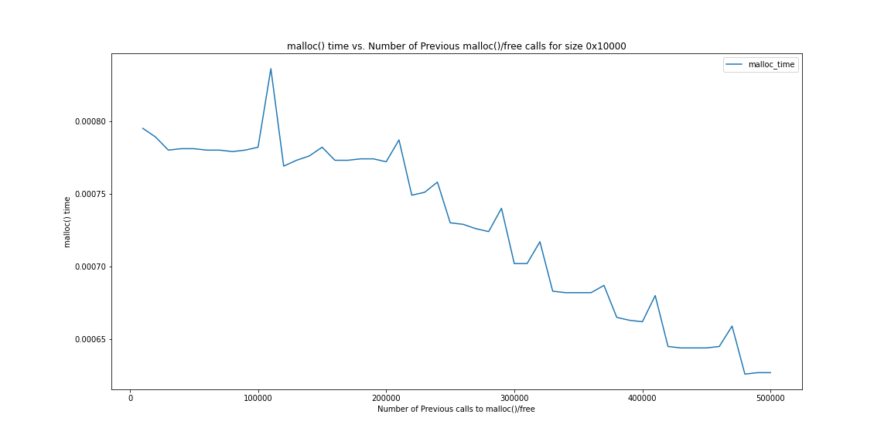
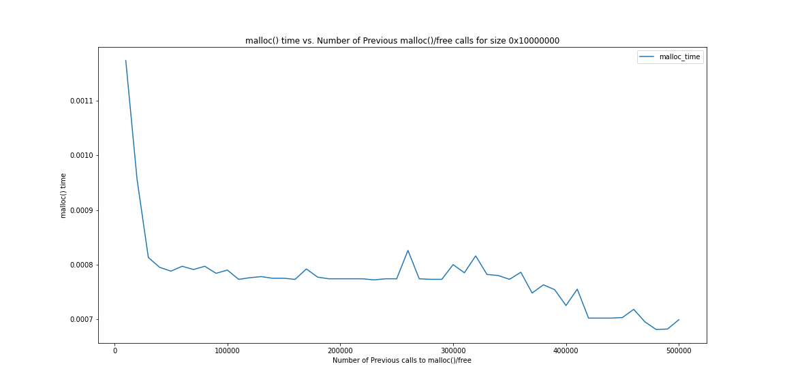

## CS333 Project 7

### Tyler Hansen, Sawyer Strong, Skye Rhomberg

#### Foreword

All C code was written exclusively by Tyler Hansen and compiled on Mac OS X Big Sur with the following `gcc` version information:

```
C:
Configured with: --prefix=/Applications/Xcode.app/Contents/Developer/usr --with-gxx-include-dir=/Applications/Xcode.app/Contents/Developer/Platforms/MacOSX.platform/Developer/SDKs/MacOSX.sdk/usr/include/c++/4.2.1
Apple clang version 12.0.0 (clang-1200.0.32.29)
Target: x86_64-apple-darwin20.2.0
Thread model: posix
InstalledDir: /Applications/Xcode.app/Contents/Developer/Toolchains/XcodeDefault.xctoolchain/usr/bin
flex 2.5.35 Apple(flex-32)

Other Languages:
go1.15.8 linux/amd64
```

I highly recommend that this repository is [viewed on GitHub](https://github.com/tylermhansen/CS333) for the best `Markdown` reading experience.

#### Compilation/Run Instructions:

For C:

```
make
./executable_name (depends on which executable you want to run)
```

For Ruby:

```
ruby filename.rb
```

#### Directory Guide:

```
project7/
├── README.md
├── c_work
│   ├── Makefile
│   ├── Memory\ Allocation\ Plotting.ipynb
│   ├── free_numbytes.png
│   ├── malloc_numbytes.png
│   ├── numberoftimes.c
│   ├── numtime0x10000000.png
│   ├── numtimes.csv
│   ├── numtimes0x10000.png
│   ├── numtimes0x10000000.png
│   ├── numtimes16.png
│   ├── timepercall.c
│   ├── timepercall.o
│   └── times.csv
├── go_work
├── ruby_work
│   ├── memory.rb
│   └── memoryhaiku.rb
└── rust_work
```

##### project7/c_work

_All of the .pngs can be ignored. They're just used in this README._ :)

- `Makefile`: A simple Makefile for compiling all of the C files for this week's C code. Usage: Run the command `make` in the directory "c_work/", then run the executable you want! _Outputs_: None
- `Memory\ Allocation\ Plotting.ipynb`: The Jupyter notebook I made to plot the memory data. Feel free to ignore, or open it with `jupyter notebook` to check it out. I used `numpy`, `matplotlib`, and `pandas`. _Outputs_: None
- `numberoftimes.c`: Explores the time that it takes (on average) to allocate a certain amount of memory over time to see if the time of a memory management call changes with the number of allocation and free operations the program has executed. With command line input, for the executable (after `make`), make sure to include the number of bytes you want to allocate with each call. _Outputs_: A tabulated output containing the number of previous calls in one column and the time it took for the 10,000 calls in the second. Can be saved directly to a csv from the terminal for convenience. Depends on user input. See `numtimes.csv` for example output.
- `numtimes.csv`: The CSV generated by the output of `numberoftimes.c`, used in the Jupyter notebook for plotting.
- `timepercall.c`: Explores the time that it takes (on average) to allocate and free a certain amount of memory. Iterates through a bunch of different sizes for `malloc()`. _Outputs_: A nicely tabulated terminal output that can be saved right to a CSV. See `times.csv` for output.
- `times.csv`: The CSV generated by the output of `timepercall.c`, used in the Jupyter notebook for plotting.

##### project7/go_work

##### project7/ruby_work

- `memory.rb`: An exploration of memory management in Ruby. Utilizes garbage collection. _Outputs_:

```
Objects Freed when retaining the objects: 2
Objects Freed when just reassigning: 100000
```

- `memoryhaiku.rb`: A cute lil' compilable Haiku in Ruby. _Outputs_: None.

##### project7/rust_work

### Part 1 of Project (Memory Allocation Exploration):

##### Task A:

_As an extension, I decided to test more than just three sizes and output the data to a .csv where I could plot it in Python for a better look._


<p align="center">
    Figure 1: The time for a call to malloc() to complete in seconds versus the number of bytes the call must allocate.
</p>

As you can see, the relationship between the time a call to `malloc()` takes and the number of bytes for that `malloc()` call to allocate is a positive one. At first glance, it looks somewhat logarithmic, however, there are more calls near 0 bytes than there are near 1.4 \* 10^8, so it could be linear as well. Thus, I estimate `mallloc()` is `O(n)` or `O(log n)`, which is pretty good. Next, I explored the relationship between the time a call to `free()` takes and the number of bytes being freed by that call:


<p align="center">
    Figure 2: The time for a call to free() to complete in seconds versus the number of bytes the call must allocate.
</p>

This, on the other hand, is very clearly exponential -- `O(2^n)` perhaps. This is interetsing because before this analysis, I would've expected `malloc()` to be the costly one and not `free()`, but it turns out that this is not the case.

##### Task B:

_As an extension, I decided to use command line input for the size to speed up the process and output the data in the command line to a .csv where I could plot it in Python for a better look._


<p align="center">
    Figure 3: The time for 10,000 calls to malloc(16) and free(16) to complete in seconds versus the number of previous calls to malloc(16) and free(16) that the program has made.
</p>



<p align="center">
    Figure 4: The time for 10,000 calls to malloc(0x10000) and free(0x10000) to complete in seconds versus the number of previous calls to malloc(0x10000) and free(0x10000) that the program has made.
</p>



<p align="center">
    Figure 5: The time for 10,000 calls to malloc(0x10000000) and free(0x10000000) to complete in seconds versus the number of previous calls to malloc(0x10000000) and free(0x10000000) that the program has made.
</p>

The plots reveal an interetsing conclusion; in general, the more calls to `malloc()` / `free()` that the program has already made, the less costly a new call is. In addition, this relationship seems to be exacerbated by the input size. This looks to be an inverse logarithmic correlation, and I find that fascinating.

#### Extensions:

##### C:

- Performed a deep time analysis of `malloc()` and `free()`, looking at way more values than expected and even saved data to `.csv` files and imported these to Python to plot them with `pandas`.
- Added command-line input for `numberoftimes.c` to make it easier for the user to explore the relationship between the number of previous `malloc()` / `free()` calls and the time a call takes.
- Created my own Makefile for my C code after learning `make`, making running the code way easier. The user just has to execute "make" into the terminal in this directory, then they can immediately execute any executable they want.

##### Other Languages:

- Note that we did the project in **three** selected languages, not just one or two. (**Go, Ruby, and Rust**)
- Created a Makefile for the Rust code for this week! Compiles the .rs files and using `make clean` removes the pesky executables. Just run `make` again in the directory to get them back.
- Wrote a compilable haiku in Ruby about memory management! :)
