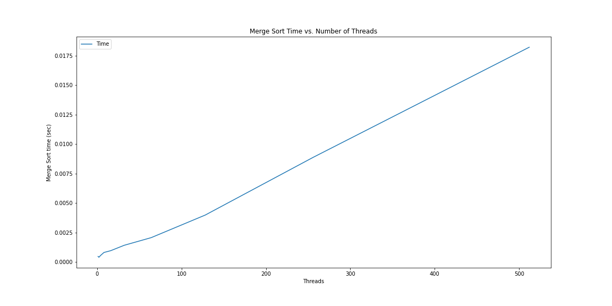

## CS333 Project 8

### Tyler Hansen, Sawyer Strong, Skye Rhomberg

#### Foreword

All C code was written exclusively by Tyler Hansen and compiled on Mac OS X Big Sur with the following `gcc` version information:

```
C:
Configured with: --prefix=/Applications/Xcode.app/Contents/Developer/usr --with-gxx-include-dir=/Applications/Xcode.app/Contents/Developer/Platforms/MacOSX.platform/Developer/SDKs/MacOSX.sdk/usr/include/c++/4.2.1
Apple clang version 12.0.0 (clang-1200.0.32.29)
Target: x86_64-apple-darwin20.2.0
Thread model: posix
InstalledDir: /Applications/Xcode.app/Contents/Developer/Toolchains/XcodeDefault.xctoolchain/usr/bin
flex 2.5.35 Apple(flex-32)

Other Languages:
go1.15.8 linux/amd64
```

I highly recommend that this repository is [viewed on GitHub](https://github.com/tylermhansen/CS333) for the best `Markdown` reading experience.

#### Compilation/Run Instructions:

For C:

```
make
./executable_name (depends on which executable you want to run)
```

For Ruby:

```
ruby filename.rb
```

#### Directory Guide:

```
/project8/
├── README.md
├── c_work
│   ├── task1
│   │   ├── Makefile
│   │   ├── Merge\ Sort\ Plotting.ipynb
│   │   ├── MergeSort.png
│   │   ├── merge_timing.csv
│   │   ├── mergesorter.c
│   │   ├── mergesortlib.c
│   │   ├── mergesortlib.h
│   │   └── timing_experiments.c
│   └── task2
│       ├── IMG_4203.ppm
│       ├── Makefile
│       ├── bold.ppm
│       ├── bw.ppm
│       ├── colorize.c
│       ├── neg.ppm
│       ├── ppmIO.c
│       └── ppmIO.h
├── go_work <-- Missing From Skye on GitHub -->
├── ruby_work
│   ├── IMG_4203.ppm
│   ├── colorize.rb
│   └── merge.rb
└── rust_work <-- Missing From Sawyer on GitHub -->
```

##### project8/c_work/task1

_All of the .pngs can be ignored. They're just used in this README._ :)

- `Makefile`: A simple Makefile for compiling all of the C files for this week's C code. Usage: Run the command `make` in either /task1/ or /task2/, then run the executable you want! _Outputs_: None
- `Merge\ Sort\ Plotting.ipynb`: The Jupyter notebook I made to plot the merge sort timing data. Feel free to ignore, or open it with `jupyter notebook` to check it out. I used `numpy`, `matplotlib`, and `pandas`. _Outputs_: None
- `merge_timing.csv.c`: The CSV generated by the output of `./Experiment`, used in the Jupyter notebook for plotting.
- `merge_timing.csv.c`: The CSV generated by the output of `./Experiment`, used in the Jupyter notebook for plotting.
- `meregesorter.c`: A simple C program with just a main function that uses `mergesortlib` and wraps its driver function. Usage: "make", then "./Mergetest <Array Length> <Number of Threads>" _Outputs_: The initial random array, and the sorted one.
- `mergesortlib.c`: A library written for multi-threaded merge sort in C. Used in `mergesorter.c` and `timing_expirements.c` Usage: None, Outputs: None
- `mergesortlib.h`: Header file ofr the `mergesortlib` library, simply contains the function stubs for the class.
- `timing_expirements.c`: A simple C program with a main function that iterates through different numbers of threads and times the merge sort of `mergesortlib` for different N threads, printing out a nice tabuluated table that can be readily saved to a `.csv`

##### project8/c_work/task2

_All of the .pngs can be ignored. They're just used in this README._ :)

- `Makefile`: A simple Makefile for compiling all of the C files for this week's C code. Usage: Run the command `make` in either /task1/ or /task2/, then run the executable you want! _Outputs_: None
- `colorize.c`: A C program that wraps the ppmIO library. User's can input an image from the command line and select either black and white, negative colors, or bold (high contrast) filters. Demonstrates multi-threaded image procressing in C. _Usage:_ "./colorize <image filename> <filter>" _Outputs_: An image file with the filter run over the original image.
- `ppmIO.c`: C-kit library provided by Ying for PPM files. Usage: None, Output: None
- `ppmIO.h`: Head file for C_kit library provided by Ying for PPM files. Usage: None, Output: None

##### project8/go_work

See Skye Rhomberg's Wiki / README. They didn't get to upload the code we worked on saved locally to their machines :)

##### project8/ruby_work

- `colorize.rb`: An attempt to do multi-threaded image processing in Ruby. This proved to be insanely difficult, as the `PNM` gem that is used to manipulate the `ppm` filetype is poorly documented. There are only two examples, and neither of them include enough information such that I could get an implementation fully working. You can see my attempt, but their write method isn't saving a file like it says it should. I wonder if its outdated....

- `merge.rb`: Multi-threaded merge sort in Ruby, written as a property of the Array class, highlighting Ruby's affinity for OOP. _Outputs_: The original randomized array and the sorted array.

##### project7/rust_work

See Sawyer Strong's Wiki / README. They didn't get to upload the code we worked on saved locally to their machines :)

### Part 1 of Project (Work in C):

##### Task A (Merge Sort):

_As an extension, I decided to test more numbers of threads and output the data to a .csv where I could plot it in Python for a better look._


<p align="center">
    Figure 1: The time for the merge sort to complete in seconds versus the number of threads used.
</p>

As you can see, the relationship between the time merge sort takes and the number of threads used is extremely linear for my implementation.

##### Task B:

I tested the time it took for each filter to run with differeent number of threads, and didn't find any noticeable difference -- I don't have the code readily available due to versioning issues and working on different devices, but there wasn't anything particularly interesting about the results on my machine.

#### Extensions:

##### C:

- Performed a deep time analysis of threads versus time for merge sort, looking at way more values than expected and even saved data to `.csv` files and imported these to Python to plot them with `pandas`.
- Added capability for any N number of threads for the merge sort.
- Added command-line input for size of array and number of threads for merge sort.
- Added **three** types of multi-threaded image manipulation and commandline input, so the user can either make the image black and white, invert the colors, or use the high-contrast bold option.
- Added capability for any N number of threads for the image processing.
- Created two unique Makefiles for my C code after learning `make`, making running the code way easier. The user just has to execute "make" into the terminal in this directory, then they can immediately execute any executable they want. Makefiles for this week were a bit more complicated than in the past.

##### Other Languages:

- Note that we did the project in **three** selected languages, not just one or two. (**Go, Ruby, and Rust**)
- Created a Makefile for the Rust code for this week! Compiles the .rs files and using `make clean` removes the pesky executables. Just run `make` again in the directory to get them back.
